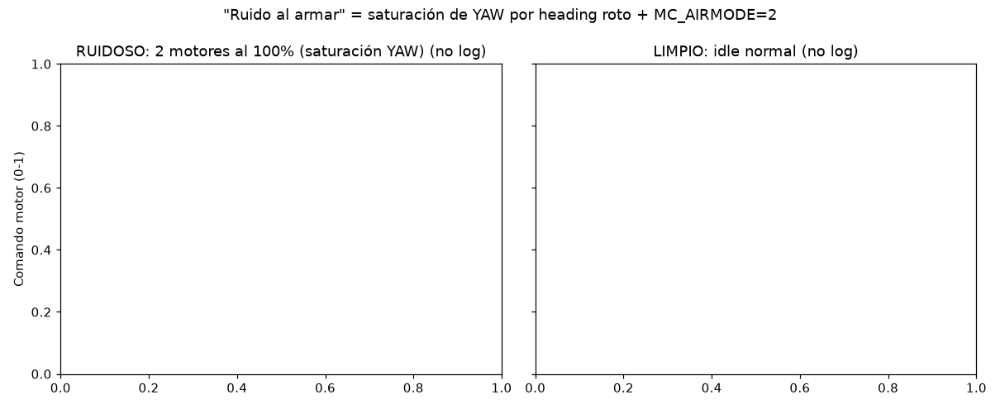
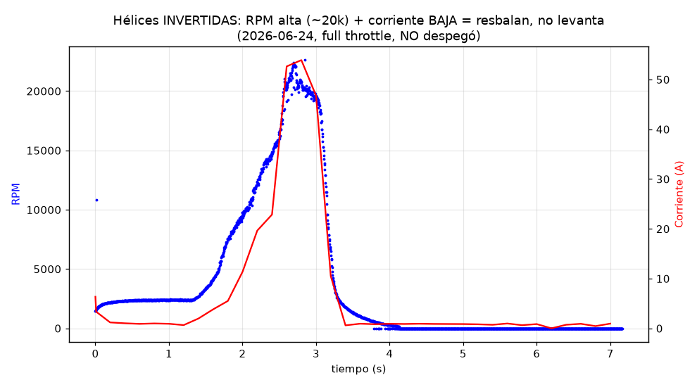
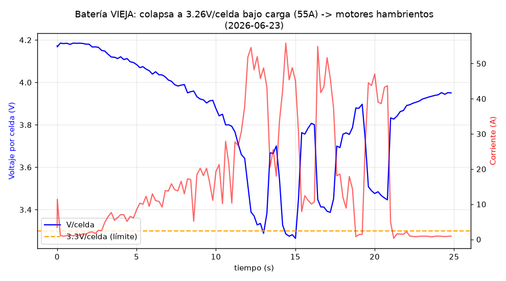
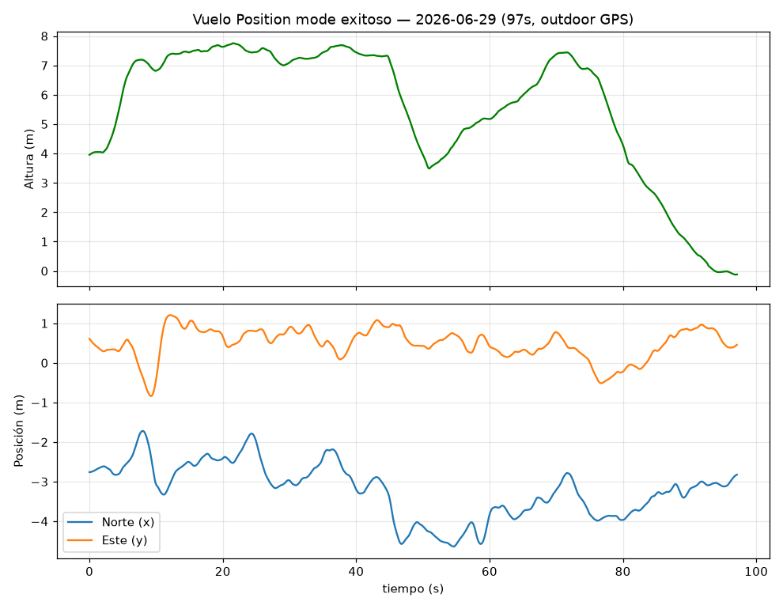
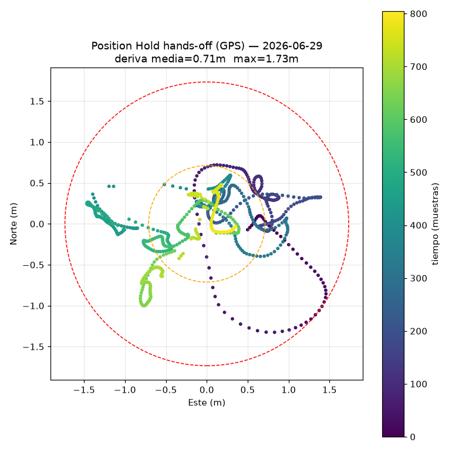

# Informe de puesta a punto y vuelo — Drone NxtPX4v2

**Plataforma:** FC NxtPX4v2 (PX4 custom 1.17) · Motores T-Motor F90 2806.5 1300KV · Quad-X · Hélices HQProp 7x4x3 (7040) · Batería 6S
**Periodo:** 2026-06-18 → 2026-06-29
**Estado final:** ✅ **Vuelo en Position mode (hands-off) logrado outdoor**

---

## 1. Resumen ejecutivo

El proyecto pasó por **cuatro problemas mayores**, todos diagnosticados con análisis de logs `.ulog` (pyulog). Resumen del viaje:

| # | Síntoma | Causa raíz | Fix |
|---|---|---|---|
| 1 | Ruido fuerte intermitente al armar | Saturación de YAW (2 motores al 100%) por heading roto + `MC_AIRMODE=2` | Restaurar brújula + `MC_AIRMODE=0` |
| 2 | No despegaba (motores giran, sin lift) | **Hélices montadas en sentido invertido** (empujaban aire hacia arriba) | Intercambiar hélices entre diagonales |
| 3 | Batería se hundía bajo carga | Pack viejo de bajo C (colapso a 3.26V/celda) | Batería de alto C |
| 4 | "No valid position estimate" indoor | GPS indoor no fiable (multipath) | Volar **outdoor** con GPS |

**Resultado final:** Position hold hands-off con **0.71m de deriva media** (línea base para comparar con GPS+RTK).

---

## 2. Problema 1 — "Ruido al armar" = saturación de YAW

El ruido intermitente al armar **NO era desincronización de ESC**. El análisis de logs mostró que en los arranques ruidosos **dos motores de un mismo diagonal iban al 100%** = el controlador saturando YAW.

- **Causa:** la brújula se había desactivado para tuning → heading sin referencia → error de heading de 90–130° → el controlador ordenaba guiñar a tope. Amplificado por `MC_AIRMODE=2` (lleva motores al 100% incluso a throttle cero).
- **Fix:** `CAL_MAG0_PRIO=50`, `SYS_HAS_MAG=1`, `EKF2_MAG_TYPE=Automatic`, `MC_AIRMODE=0`.



> Detalle completo en [DIAGNOSTICO_RUIDO_MOTORES_YAW.md](DIAGNOSTICO_RUIDO_MOTORES_YAW.md)

---

## 3. Problema 2 — No despegaba: HÉLICES INVERTIDAS (el grande)

El dron no levantaba ni un cm pese a motores girando. Tras descartar batería, ESC, config y modo, la **telemetría de RPM (bidir DShot)** dio la prueba definitiva:

- Motores alcanzaban **~20,000 RPM** (velocidad correcta → ESC y motores OK).
- Pero la corriente era **muy baja (~13A/motor** vs 25–35A esperados).
- **RPM alta + corriente baja + no levanta = las hélices resbalan = giran en sentido equivocado → empujan aire hacia ARRIBA.**

La observación física del usuario ("el aire va hacia arriba") era **REAL** — no recirculación.



- **Causa:** las hélices estaban en los motores del sentido de giro equivocado (el borde de fuga lideraba en vez del borde de ataque).
- **Nota clave:** el label "R" de HQProp **no está estandarizado** entre marcas — se verificó por **borde de ataque + flujo de aire físico**, no por etiqueta.
- **Fix:** intercambiar las hélices entre diagonales (motores 1,2 ↔ 3,4) hasta que las 4 soplaran hacia abajo.

**Confirmación tras el fix:** levanta con ~12A (vs no levantaba a 54A con hélices invertidas).

---

## 4. Problema 3 — Batería que colapsa bajo carga

El pack viejo (1300mAh bajo C) se **hundía a 3.26V/celda a solo 55A**, dejando los motores sin voltaje → poco empuje. Fue un factor secundario (el principal eran las hélices), resuelto con una **batería de alto C**.



---

## 5. Problema 4 — Position mode indoor vs outdoor

- **Indoor:** GPS con multipath → `xy_valid=0%`, "no valid position estimate", altura del EKF divergiendo (hasta −11m falsos). Position mode **bloqueado** (correctamente, por seguridad).
- **Outdoor:** GPS limpio (fix 4, sats 12–17, EPH 0.5m) → `xy_valid=100%` → Position mode funciona.

---

## 6. Resultado final — Position hold hands-off ✅

Vuelos del 2026-06-29 en outdoor: auto-takeoff → Hold → Position, 60–97s cada uno, soltando los sticks.



**Calidad del position hold (sticks centrados, 806 muestras):**

| Métrica | Valor |
|---|---|
| Deriva horizontal media | **0.71 m** |
| Deriva horizontal máx | **1.73 m** |
| Altura | ~5.8 m estable |
| xy_valid | 100% |
| GPS | fix 4, 12–13 sats, EPH 0.5m |



> **0.71m es excelente para GPS estándar.** Es la **línea base para comparar con GPS+RTK** (que debería dar ~0.02–0.10m, 10–30× mejor).

---

## 7. Configuración de referencia (estado final que vuela)

```
# Sensores / EKF
SYS_HAS_MAG     = 1
CAL_MAG0_PRIO   = 50
EKF2_MAG_TYPE   = 0 (Automatic)
EKF2_MAG_CHECK  = 1
EKF2_GPS_CTRL   = 7        (outdoor)
EKF2_HGT_REF    = 1 (GPS, outdoor) / 0 (Baro, indoor)

# Seguridad / control
MC_AIRMODE      = 0
MC_THR_HOVER    = 0.5  (hover real ~30%)
DSHOT_BIDIR_EN  = 1    (telemetría RPM activada)

# Batería
BAT1_N_CELLS    = 6
BAT1_V_EMPTY    = 3.5

# Motores (mapeo)
PWM_MAIN_FUNC1..4 = 101,104,102,103   # (verificado en log 2026-07-01)
```

### Lecciones clave
1. Un **ruido intermitente al armar** puede ser saturación de control, no ESC — verificar con logs.
2. **Motores girando ≠ empuje**: con motores potentes, hélices invertidas dan RPM alta + corriente baja + cero lift. Verificar **flujo de aire hacia abajo**.
3. El **label de hélice no es fiable** — usar borde de ataque + test físico.
4. **Position mode necesita posición válida** — indoor sin GPS/LiDAR no funciona; outdoor sí.
5. En **Stabilized no cortar throttle de golpe** (se pierde autoridad de actitud → vuelco).

---

## 8. Herramientas de análisis

Entorno: venv con `pyulog` + `matplotlib` en `/home/kmedrano/src/Asistente/.venv`.

Scripts reutilizables en `/home/kmedrano/src/drone_tunning/`:
- `analyze_motor_noise.py` — clasifica logs armar/desarmar (idle limpio vs saturado) e identifica eje.
- `analyze_takeoff_fail.py` — modo, GPS, validez de posición, failsafe flags, actividad de motores.

Logs de vuelo en `/home/kmedrano/Documents/QGroundControl/Logs/<fecha>/`.

---

## 9. Próximos pasos

1. **Test de precisión de landing** (objetivo original): marcar blanco, aterrizar N veces, medir dispersión física (CEP) → comparar GPS vs GPS+RTK.
2. **Integrar RTK** y repetir el position hold → comparar con la línea base de 0.71m.
3. (Opcional) Tuning de rate controller para respuesta más crujiente — los defaults ya vuelan bien.
4. (Futuro) Position hold **indoor** con odometría del Livox LiDAR (EV/external vision).
