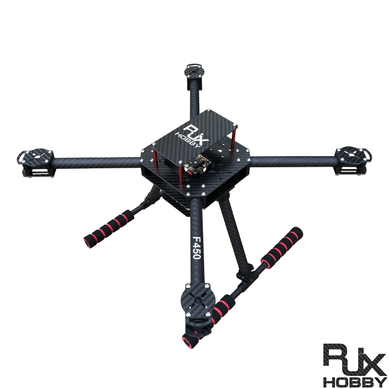
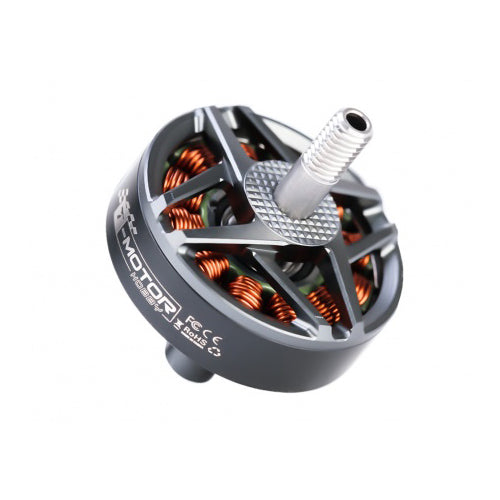
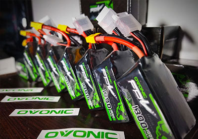
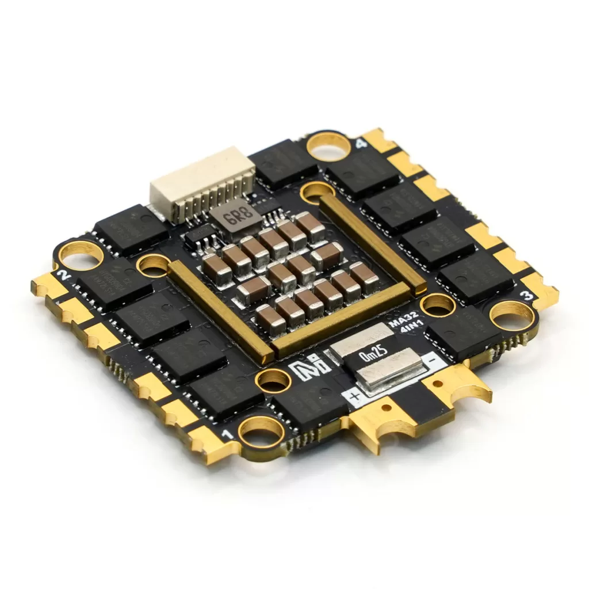
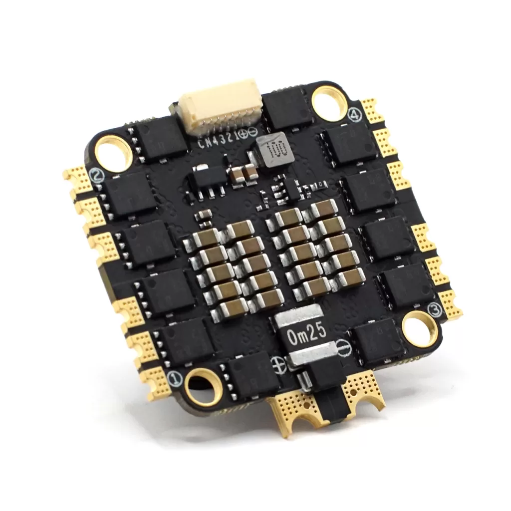
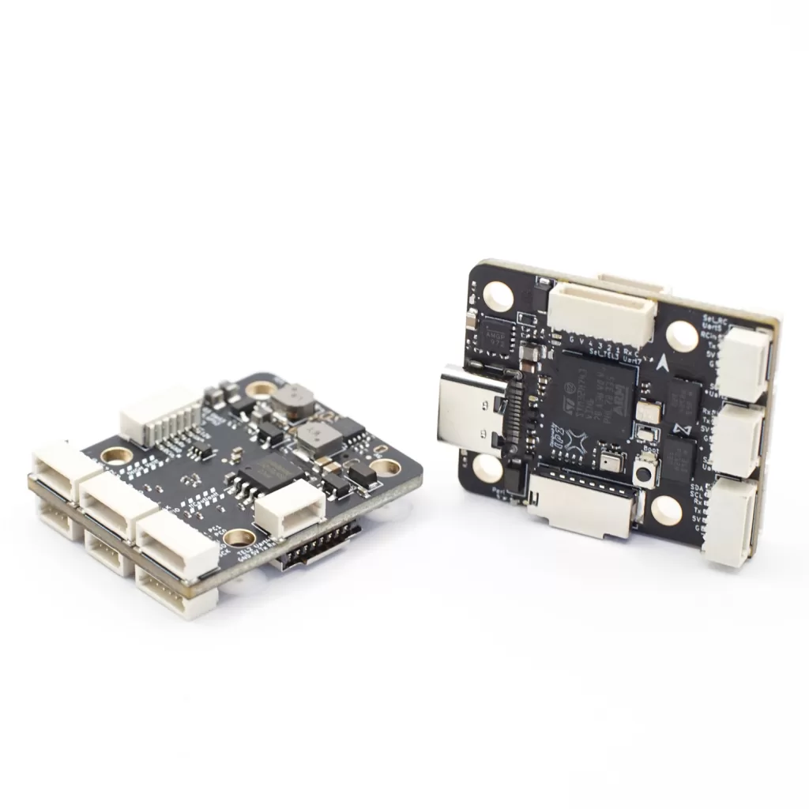
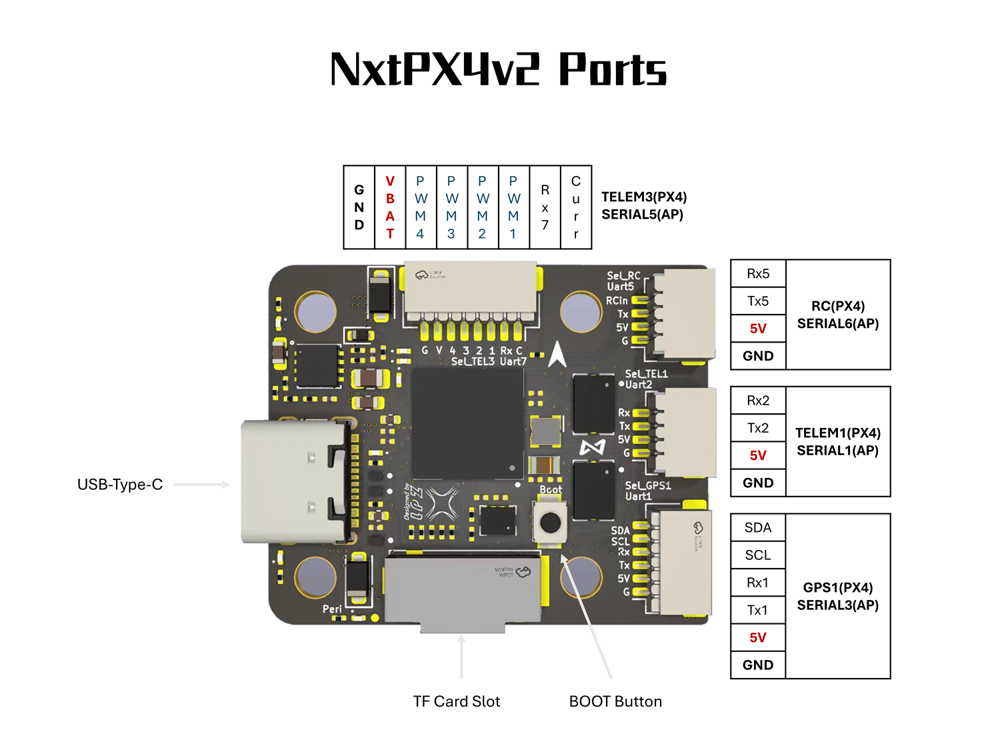
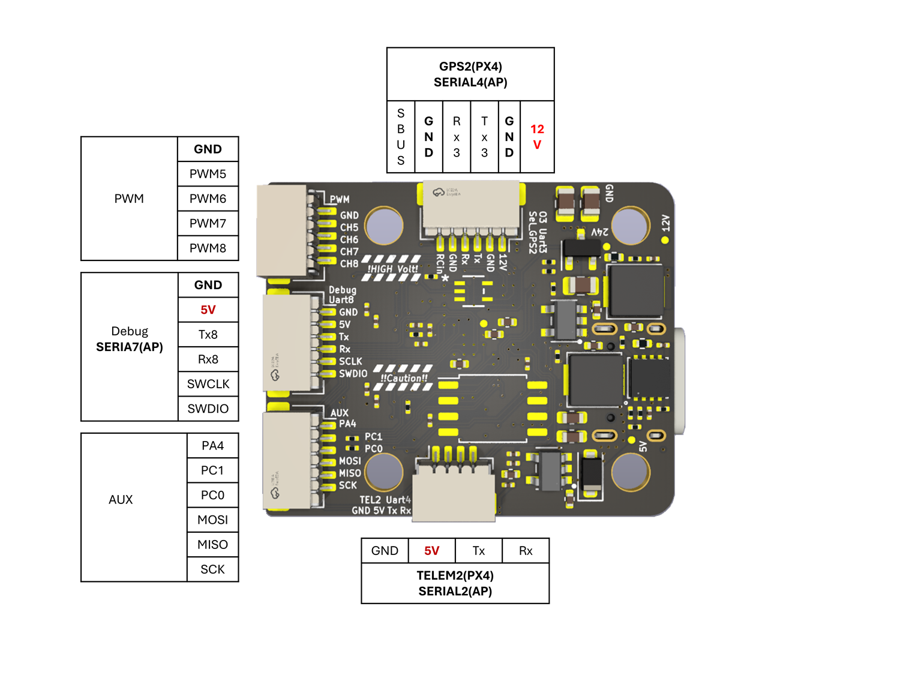
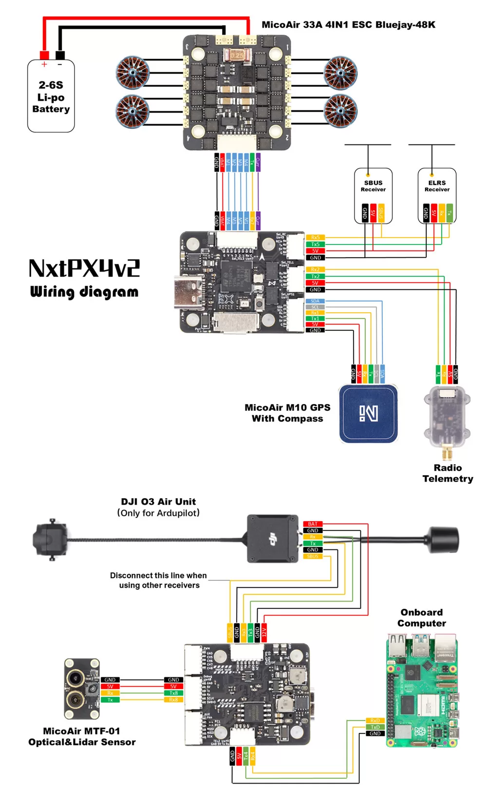
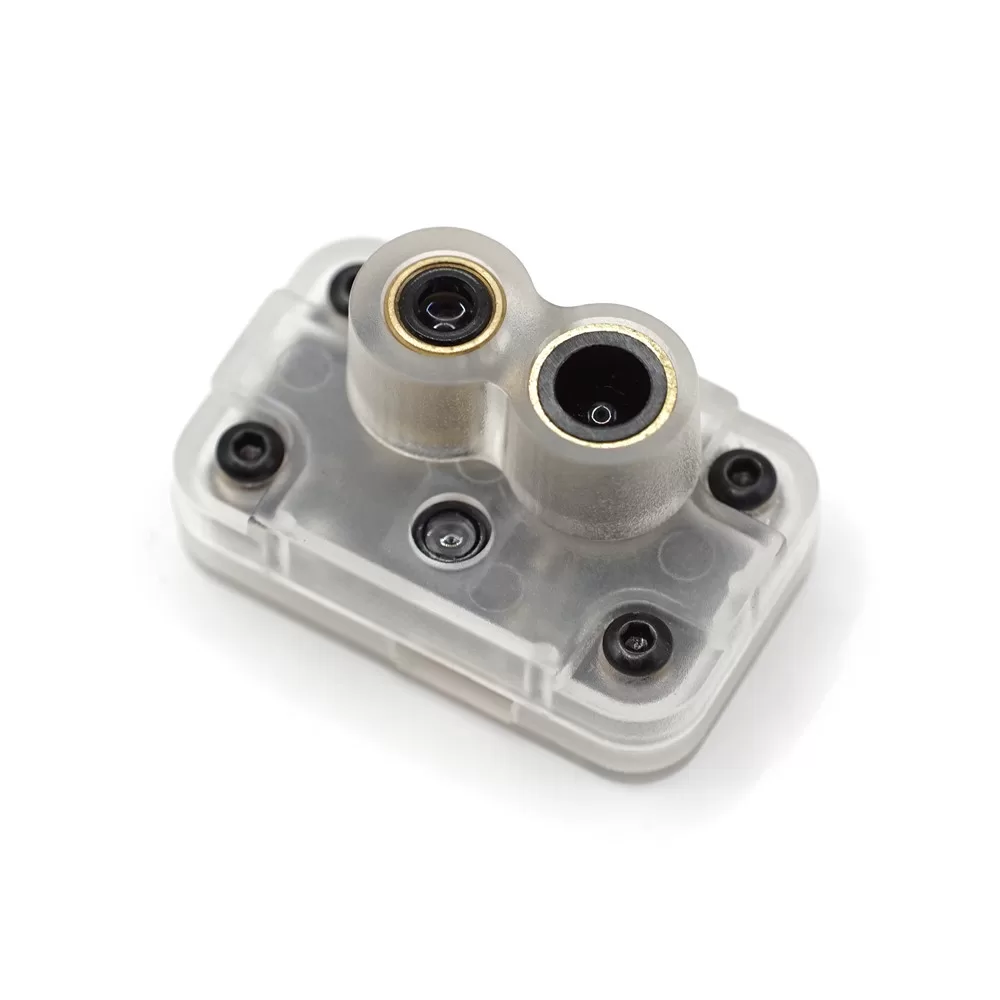

# Plataforma — hardware, firmware y comunicaciones

Ficha técnica completa del dron: qué hay montado, qué firmware corre y cómo se comunica todo.

**Última verificación contra el FC:** 2026-09-07 · Volcado: [`backups/backup_fc_2026-09-07.params`](../backups/backup_fc_2026-09-07.params)

> Esta plataforma **replica la del proyecto SUPER** (HKU MaRS Lab) como base para desarrollar
> mejoras encima. La comparación con su BOM original y las diferencias deliberadas están
> en la [§7](#7-referencia-super-hku-mars-lab).

---

## 1. Airframe y propulsión

<table>
<tr>
<td width="33%"><br><sub><b>Frame</b> RJX F450 carbono</sub></td>
<td width="33%"><br><sub><b>Motor</b> T-Motor F90 2806.5 1300KV</sub></td>
<td width="33%"><br><sub><b>Batería</b> Ovonic 6S 1300 mAh 100C</sub></td>
</tr>
</table>


| Componente | Modelo | Especificación clave |
|---|---|---|
| Frame | **RJX F450**, fibra de carbono | Wheelbase **450 mm** (diagonal entre motores opuestos) · [ficha](https://www.rjxhobby.com/rjx-f450-carbon-fiber-frame-kit) |
| Configuración | Quad-X | `SYS_AUTOSTART=4001`, `CA_AIRFRAME=0` |
| Motores (4×) | **T-Motor F90 2806.5 · 1300 KV** | 33.4 × 34.7 mm · eje 4 mm · **46.6 g** · 5-6S · pico **45.1 A / 1059 W** · **2360 g de empuje** al 100% con hélice 7×4 · [ficha](https://www.t-hobby.com/products/brushless-motor-x8-fpv-drones-f90-2806-5) |
| Hélices (4×) | **HQProp 7×4×3** (7040), tripala | 7" |
| ESC | **MicoAir Bluejay-4IN1-60A** | 60 A × 4 · 3-6S · firmware **Bluejay 0.19.2** (BLHeli_S) · 44 × 43.5 × 5.2 mm · 13.5 g · montaje 30.5×30.5 (Φ4) · [ficha](https://micoair.com/esc/) |
| Batería | **Ovonic 6S1P 1300 mAh 100C** | 22.2 V · **222 g** · 74 × 44 × 34 mm · XT60 · 130 A continuos / 260 A pico · [ficha](https://www.ampow.com/products/ovonic-100c-1300mah-6s1p-22-2v-xt60-4pcs-lipo-battery) |
| Protocolo de motor | DShot 600 | `PWM_MAIN_TIM0=-3`, `DSHOT_MIN=0.055` |
| Mapeo de motores | `PWM_MAIN_FUNC1..4 = 101, 104, 102, 103` | migrado y verificado |

**Empuje de hover medido en vuelo real:** 0.284 (media) / 0.287 (mediana), p10-p90 0.270-0.295
→ `MPC_THR_HOVER=0.30`. El grupo propulsor da **9.4 kg de empuje total**, muy sobrado para un
F450 — margen pensado para cargar el MID360 y el ordenador a bordo.

### ⚠️ Dos cosas a revisar

**~~La geometría del mixer no cuadra con el frame.~~ ✅ Corregido (2026-09-07).** Un F450 tiene
450 mm de diagonal, así que cada rotor va a **±0.159 m** en X e Y (225/√2). Estaba en ±0.17 (y en
el FC#1, ±0.15). Ya actualizado a **±0.159** en los cuatro rotores, con los opuestos en negativo.
QGC muestra `0.16` por redondeo a dos decimales; el valor guardado es 0.159.

**Autonomía muy corta.** 1300 mAh es **2.5× menos** que los 3300 mAh de la BOM de SUPER. Con
estos motores en hover el consumo estará en el entorno de 20-30 A, lo que deja del orden de
**3-4 minutos de vuelo** — estimación gruesa, hay que medirla con el log de `battery_status`.
Suficiente para pruebas indoor cortas; escaso para el trabajo de navegación de SUPER.

⚠️ Los ESC generan el **beacon** haciendo sonar los propios motores (no llevan buzzer): energizan
las bobinas a frecuencia audible sin conmutar, y el estátor vibra. Tras ~10 min inactivo empieza
a pitar. No se puede desactivar desde PX4 — no hay passthrough BLHeli ni comando DShot de beacon.

### ESC — familia MicoAir 4-en-1

<table>
<tr>
<td width="50%"><br><sub><b>AM32-4IN1-55A</b></sub></td>
<td width="50%"><br><sub><b>Bluejay-4IN1-60A</b></sub></td>
</tr>
</table>


Los tres modelos que vende el fabricante del FC. Todos soportan **DShot300/600** y sacan
**12.75 mV/A** de sensor de corriente.

| Modelo | Corriente | Celdas | Firmware | Tamaño | Peso | Montaje |
|---|---|---|---|---|---|---|
| AM32-4IN1-55A | 55 A × 4 | 2-6S | AM32 `F4A_4IN1_F421_2.17` | 44 × 43.5 × 5.2 mm | 14 g | 20×20 (Φ3) o 30.5×30.5 (Φ4) |
| ✅ **Bluejay-4IN1-60A** | **60 A × 4** | **3-6S** | **Bluejay 0.19.2** (BLHeli_S) | **44 × 43.5 × 5.2 mm** | **13.5 g** | **30.5×30.5 (Φ4)** |
| **Bluejay-4IN1-33A** | 33 A × 4 | 2-6S | **Bluejay** 0.19.2 (BLHeli_S) | 29 × 31 × 5.3 mm | 5 g | 20×20 (Φ3) |

**El montado es el Bluejay-4IN1-60A.** Los 60 A por canal cubren con margen los **45.1 A de pico**
que pide cada motor.

💡 **Para subir el beacon delay:** al ser **Bluejay** (derivado de BLHeli_S), el configurador es
**BLHeli Configurator** (o el Bluejay Configurator), donde están *Beacon Delay* (1/2/5/10 min o
infinito) y *Beacon Strength*.

Hay que llegar al ESC **por la línea de señal**: linker USB directo a los pads, o una placa
Betaflight haciendo de puente 4-way. **PX4 no tiene passthrough** — verificado en el fuente de la
1.14.3.

---

## 2. Controlador de vuelo

Dos unidades del **mismo modelo**, con firmware distinto. No confundirlas.

| | **FC#1** | **FC#2** (en uso) |
|---|---|---|
| Modelo | HKUST **NxtPX4v2** | HKUST **NxtPX4v2** |
| Board ID | 1013 | 1013 |
| Firmware | PX4 **1.17.0** (build custom) | PX4 **1.14.3** de fábrica |
| Uso | primer dron | **segundo dron, plataforma actual** |



### Especificaciones ([ficha del fabricante](https://micoair.com/flightcontroller_nxtpx4v2/))

| | |
|---|---|
| MCU | **STM32H743VIH6** @ 480 MHz, 2 MB Flash |
| Encapsulado | **TFBGA100, 8.0 × 8.0 × 1.10 mm**, pitch 0.8 mm, sin pad térmico expuesto |
| IMU | **2× BMI088** |
| Barómetro | **SPL06** |
| Almacenamiento | ranura microSD |
| Puertos serie | **7 UART** (GPS, telemetría, RC, telemetría de ESC) |
| Otros buses | 1× I2C (brújula externa) · 1× SPI · SWD · USB-C |
| Salidas de motor | **8 PWM** con soporte DShot |
| BEC | **5 V / 2.5 A** y **12 V / 2.5 A** |
| Medida de batería | sensor de tensión interno + entrada de corriente externa (2 canales ADC) |
| RC | SBUS y CRSF por UART dedicada |
| Dimensiones | **27 × 32 × 8 mm** · **6.5 g** |
| Montaje | 20 × 20 mm, agujeros Φ3 mm |
| Flash utilizable | 1792 KiB · bootloader **rev 5** |

El repo de hardware ([Peize-Liu/Nxt-FC-Hardware](https://github.com/Peize-Liu/Nxt-FC-Hardware))
indica 27 × 29 × 8 mm — pequeña discrepancia entre revisiones.

💡 El **BEC de 12 V / 2.5 A** es el que alimentará el Livox MID360 (9-27 V) cuando llegue.

⚠️ **Térmico:** en banco sin airflow el barómetro llegó a **89.5 °C** y las IMU a 74.6 °C — por
encima del límite de 85 °C de los sensores. En vuelo baja ~8 °C en 4 min. Un disipador de
**8×8×5 mm** con cinta térmica encaja sobre el encapsulado (hay ~0.7 mm libres alrededor).

⚠️ **El firmware no se puede volcar del board:** el bootloader rev 5 rechaza `CHIP_VERIFY` (0x24)
y `READ_MULTI` (0x28), que son rev2-only. Guardar el `.px4` **antes** de flashear.

### Diagramas de puertos (fabricante)

| Cara superior | Cara inferior |
|---|---|
|  |  |

**Diagrama de cableado completo** — qué va en cada conector:



Correspondencia entre la serigrafía de la placa y los nombres de PX4:

| Conector (serigrafía) | UART | PX4 | ttyS | Señales del conector |
|---|---|---|---|---|
| `GPS1` / `Uart1` | USART1 | GPS1 | ttyS0 | SDA, SCL, Rx1, Tx1, 5V, GND |
| `TEL1` / `Uart2` | USART2 | TELEM1 | ttyS1 | Rx2, Tx2, 5V, GND |
| `GPS2` / `Uart3` | USART3 | GPS2 | ttyS2 | SBUS, GND, Rx3, Tx3, GND, **12V** |
| `TEL2` / `Uart4` | UART4 | TELEM2 | ttyS3 | GND, 5V, Tx, Rx |
| `RC` / `Uart5` | UART5 | RC | ttyS4 | Rx5, Tx5, 5V, GND |
| `TEL3` / `Uart7` | UART7 | TELEM3 | ttyS6 | GND, VBAT, PWM4..1, **Rx7**, Curr |
| **`Debug` / `Uart8`** | **UART8** | **TELEM4** | **ttyS7** | GND, 5V, **Tx8, Rx8**, SCLK, SWDIO |

### 🔴 Corrección: el conector "Debug" **sí lleva UART**

El diagrama del fabricante desmiente lo que concluimos en julio. La serigrafía dice
**`Debug Uart8`** y el conector expone **`Tx8` y `Rx8` junto a `SWCLK`/`SWDIO`** — es un conector
mixto UART + SWD, no SWD puro.

Es decir: **el conector "Debug" ES el UART8 = TEL4 = `/dev/ttyS7`**, exactamente donde está
conectado el MTF-01P. El sensor lleva todo este tiempo enchufado ahí.

El fallo de julio (`rx=0.0` en `ttyS5`) no era falta de UART en el conector: era que se estaba
leyendo el **puerto equivocado**. Se asumió que el "Debug" era USART6/`ttyS5` y se llegó a
recompilar el firmware para liberar esa consola; el conector era UART8/`ttyS7` desde el principio.
Al mapear TEL4 el sensor apareció — sin haber movido el cable.

> ⚠️ Corregir también [`INTEGRACION_MTF-01P_FLOW_LIDAR.md`](INTEGRACION_MTF-01P_FLOW_LIDAR.md) §2,
> que afirma que el conector es SWD-only.

---

## 3. Sensores

| Sensor | Modelo | Bus / puerto | Estado |
|---|---|---|---|
| Flujo óptico + LiDAR | **MicoAir MTF-01P** | TEL4 / UART8 (`/dev/ttyS7`) @115200 | ✅ operativo |
| IMU | **2× BMI088** | SPI | ✅ calibradas de fábrica |
| Barómetro | **SPL06** | I2C bus 1, `0x77` | ✅ |
| Magnetómetro | **ninguno** | — | ❌ ver §5 |
| GPS / brújula | M100-5883 | GPS1 | solo en FC#1; **no montado en FC#2** |
| LiDAR 3D | Livox MID360 | — | ⏳ pendiente (driver ya en el workspace) |

### MTF-01P — límite real medido




Declara 12 m de alcance. **Medido el 2026-09-07 en interior:**

| Altura real | Lee | Error |
|---|---|---|
| 0.14 m | 0.14 m | −4% |
| 1.0 m | 0.95 m | −5% |
| 3.0 m | 2.14 m | **−29%** |
| 5-6 m | 2-3 m | saturado |

**Techo útil ≈ 1.5 m.** Por encima la lectura deja de ser invertible: 2.5 m puede significar 3 o 6
metros. Y el sensor **nunca reporta baja confianza** (`signal_quality: -1`, varianza pequeña), así
que el EKF no tiene forma de rechazarla. Datos: [`logs/2026-09-04/lidar_barrido_altura_2026-09-07.csv`](../logs/2026-09-04/lidar_barrido_altura_2026-09-07.csv).

Protocolo: `Mavlink_PX4` (configurable con MicoAssistant). Conector SH1.0-4P `GVRT`, **5 V**,
señal 3.3 V. Emite `OPTICAL_FLOW_RAD` (106) a 100 Hz y `DISTANCE_SENSOR` (132).

---

## 4. Companion

| | |
|---|---|
| Equipo | **Raspberry Pi 4** |
| SO | Ubuntu 24.04 LTS |
| ROS | **ROS 2 Jazzy** |
| Enlace al FC | uXRCE-DDS sobre UART, `/dev/ttyAMA0` @921600 |
| `px4_msgs` | rama **`release/1.14`** = commit `ffb6e80` |

`px4_msgs` verificado: los **184 `.msg` son byte a byte idénticos** a los de `PX4-Autopilot@v1.14.3`.

⚠️ En 1.14.3 **los topics no llevan sufijo `_v1`** — el versionado de mensajes llegó en 1.16+.
Es `/fmu/out/vehicle_local_position`, no `..._v1`. Usar el nombre versionado no da error: da silencio.

---

## 5. Firmware — versiones exactas

| | FC#1 | FC#2 (actual) |
|---|---|---|
| Versión | 1.17.0 | **1.14.3** |
| Branch | `main` | `micoair743-v1.14.3` |
| Git hash | `82e3322e` | `4a0e65f2` ⚠️ **no existe en upstream** — fork del fabricante |
| Build | reflasheado 2026-07-17 | Nov 19 2024 |
| HW arch | HKUST_NXT_DUAL | HKUST_NXT_DUAL |
| NuttX | — | 11.0.0 |

**Decisión (2026-09-04): conservar la 1.14.x de fábrica en el FC#2**, no reflashear.

### Tres límites de este firmware que condicionan todo

1. **Solo declara 2 puertos serie: GPS1 y TEL1.** Los códigos 102/103/104 (`MAV_x_CONFIG`,
   `UXRCE_DDS_CFG`, `GPS_x_CONFIG`) **no mapean a ningún dispositivo** — fallan en silencio.
   Solución: arrancar los servicios con ruta cruda desde `extras.txt` (§6).
2. **No trae el driver `qmc5883p`**, solo `qmc5883l`. Son chips distintos → **no hay brújula
   posible** sin cambiar de magnetómetro o de firmware.
3. **`SENS_FLOW_ROT` no existe** → la rotación del flujo está clavada en 0. El sensor debe ir
   montado con su eje X hacia adelante.

Versiones guardadas y cómo reconstruirlas: [`backups/firmware/INDEX.md`](../backups/firmware/INDEX.md).

---

## 6. Comunicaciones

### Mapa de UARTs del NxtPX4v2

| ttyS | UART | Pines | PX4 | Código | Uso actual |
|---|---|---|---|---|---|
| ttyS0 | USART1 | PB10/PA9 | GPS1 | 201 | libre (sin GPS) |
| ttyS1 | USART2 | PD6/PD5 | TEL1 | 101 | **radio MAVLink** |
| ttyS2 | USART3 | PD9/PD8 | GPS2 | 202 | libre |
| **ttyS3** | UART4 | PB8/PB9 | TEL2 | 102 | **RPi 4 (uXRCE-DDS)** |
| ttyS4 | UART5 | PB12/PB13 | RC | 300 | receptor |
| ttyS5 | USART6 | PC7/PC6 | — | — | sin conector expuesto |
| ttyS6 | UART7 | PE7/PE8(NC) | TEL3 | 103 | telemetría ESC (RX-only) |
| **ttyS7** | UART8 | PE0/PE1 | TEL4 | 104 | **MTF-01P** — conector rotulado `Debug` |

💡 El conector rotulado **`Debug`** es UART8 + SWD en el mismo header (ver §2). Es TEL4: ahí va
el MTF-01P. Lo que **no** existe es un conector para USART6.

### Radio MAVLink (telemetría / QGC)

| | |
|---|---|
| Puerto FC | TEL1 (`MAV_0_CONFIG=101`) |
| Velocidad | 57600 (`SER_TEL1_BAUD`) |
| Caudal | `MAV_0_RATE=1200` B/s |
| Modo | Normal (`MAV_0_MODE=0`) |
| Lado PC | CP2102 USB-UART → `/dev/ttyUSB0` |
| Versión | MAVLink v1/v2 según negociación |

Sirve para QGC **y** para los scripts de `scripts/mavlink/` — incluida la consola NuttX por
`SERIAL_CONTROL`. Un volcado completo de 906 parámetros tarda 16 s por este enlace.

### Enlace offboard RPi ⇄ FC (uXRCE-DDS)

```
Raspberry Pi 4                                   FC NxtPX4v2
┌────────────────────────┐                      ┌──────────────────────────┐
│ ROS 2 Jazzy            │                      │ PX4 1.14.3               │
│ Micro-XRCE-DDS Agent ◄─┼──── UART 921600 ─────┼─► uxrce_dds_client       │
│ px4_msgs release/1.14  │  ttyAMA0 ↔ ttyS3     │   arrancado por extras   │
└────────────────────────┘                      └──────────────────────────┘
```

Cableado: TX↔RX cruzados, **GND común obligatorio**, **NO** llevar los 5 V del TELEM a la Pi.
Ambos lados son lógica 3.3 V, sin level shifter.

⚠️ `UXRCE_DDS_CFG=0` **a propósito**: el código 102 no existe en este firmware. El cliente se
arranca por ruta cruda desde la SD.

### Servicios arrancados desde la tarjeta SD

`/fs/microsd/etc/extras.txt` — lo ejecuta `rcS` en cada arranque (`. $FEXTRAS`):

```sh
mavlink start -d /dev/ttyS7 -b 115200 -m minimal          # MTF-01P
uxrce_dds_client start -t serial -d /dev/ttyS3 -b 921600  # RPi 4
```

⚠️ **Esta configuración vive en la SD, no en la memoria de parámetros del FC.** Si la tarjeta
falla o se borra el fichero, ni el sensor ni el enlace offboard arrancan.
⚠️ El `echo` de NuttX conserva las comillas simples literalmente — escribir el fichero **sin comillas**.

### Radiocontrol — ExpressLRS

| | |
|---|---|
| Emisora | **Jumper T-Pro V2** |
| Módulo TX | **ExpressLRS** ⏳ modelo y enlace por confirmar |
| Receptor | **ExpressLRS** ⏳ modelo y enlace por confirmar |
| Protocolo | **CRSF** (`RC_INPUT_PROTO=6`) — el que usa ELRS |
| Canales | 16 (`RC_CHAN_CNT=16`) |
| Puerto en el FC | `RC` / UART5 (`/dev/ttyS4`), código 300 |

El conector `RC` de la placa expone **Rx5, Tx5, 5V, GND** — CRSF necesita las dos líneas (es
bidireccional, a diferencia de SBUS), así que hay que cablear Tx **y** Rx.

⚠️ Delta respecto a SUPER, que en su BOM usa Radiolink AT9S + R12DSM sobre **SBUS**.

---

## 7. Referencia: SUPER (HKU MaRS Lab)

Esta plataforma replica la de **SUPER — Safety-assured High-speed Navigation for MAVs**
(*Science Robotics*, 2025), del HKU MaRS Lab, para luego construir mejoras encima.

- **Hardware:** https://github.com/hku-mars/SUPER-Hardware
- **Software:** https://github.com/hku-mars/SUPER
- **Fork propio (adaptado a ROS 2 + Gazebo Sim):** https://github.com/Kmedrano101/SUPER

### Comparación con la BOM original

| Componente | SUPER original | Esta plataforma | |
|---|---|---|---|
| Controlador de vuelo | **NxtPx4** | NxtPX4v2 | ✅ igual |
| Motores | **T-Motor F90 KV1300** | T-Motor F90 2806.5 1300 KV | ✅ igual |
| Hélices | **HQ 7×4×3** | HQProp 7×4×3 | ✅ igual |
| Batería | DualSky 3300 mAh 6S | **Ovonic 1300 mAh 6S** | ⚠️ 2.5× menos autonomía |
| ESC | T-Motor F60A mini 4-en-1 | **MicoAir Bluejay-4IN1-60A** | 🔵 equivalente |
| LiDAR 3D | **Livox MID360** | pendiente | ⏳ |
| Ordenador a bordo | **ASUS NUC 12 Pro** | **Raspberry Pi 4** | 🔴 delta |
| RC | Radiolink AT9S + R12DSM (SBUS) | receptor CRSF | 🔵 delta menor |
| Módulo de potencia | CKCS CK2416 (12 V 16 A) | BEC del FC (12 V 2.5 A) | ⏳ insuficiente para un NUC |
| Frame | no especificado en la BOM | **RJX F450** carbono, 450 mm | 🔵 |

### Deltas de software

| | SUPER original | Esta plataforma |
|---|---|---|
| ROS | ROS1 Noetic (Tier 1); ROS2 Foxy en desarrollo | **ROS 2 Jazzy** |
| SO | Ubuntu 20.04 | Ubuntu 24.04 |
| Puente al autopiloto | MAVROS | **uXRCE-DDS** |
| Simulador | MARSIM | **Gazebo Sim** (MARSIM eliminado del fork) |
| Odometría | FAST-LIO | FAST-LIO (`fast_lio_ros2` en el workspace) |

El fork propio ya incorpora `px4_super_bridge` y `px4_mpc_controller`, que no existen en el
upstream.

### Módulos de SUPER

| Módulo | Función |
|---|---|
| **ROG-Map** | mapa de ocupación del entorno |
| **CIRI** | corredores de vuelo seguros en espacio de configuración |
| Optimización de trayectoria | planificación diferenciable por descomposición convexa |
| `mission_planner` | objetivos de navegación de alto nivel |

### 🔴 El delta con riesgo real: NUC → Raspberry Pi 4

SUPER corre ROG-Map, CIRI y la optimización de trayectoria en un **ASUS NUC 12 Pro**. Una
Raspberry Pi 4 tiene bastante menos cómputo. El enlace uXRCE-DDS y los nodos de control ligeros
no son problema, pero el planificador completo a alta velocidad es otra cosa.

Conviene medirlo pronto — antes de invertir en el MID360 — corriendo ROG-Map y el planner sobre
datos grabados en la Pi y midiendo el tiempo de ciclo. Si no llega, las salidas son bajar la
velocidad objetivo, aligerar la resolución del mapa, o cambiar de ordenador a bordo.

---

## Enlaces a componentes

> Las imágenes de `docs/images/hardware/` son fotos de producto de cada fabricante, incluidas
> aquí como referencia técnica. La fuente de cada una es el enlace de su fila.


| Componente | Enlace |
|---|---|
| Controlador de vuelo NxtPX4v2 | https://micoair.com/flightcontroller_nxtpx4v2/ |
| Hardware del FC (esquemas, KiCad) | https://github.com/Peize-Liu/Nxt-FC-Hardware |
| Motores T-Motor F90 2806.5 | https://www.t-hobby.com/products/brushless-motor-x8-fpv-drones-f90-2806-5 |
| Frame RJX F450 carbono | https://www.rjxhobby.com/rjx-f450-carbon-fiber-frame-kit |
| Batería Ovonic 6S 1300 mAh 100C | https://www.ampow.com/products/ovonic-100c-1300mah-6s1p-22-2v-xt60-4pcs-lipo-battery |
| ESC MicoAir 4-en-1 | https://micoair.com/esc/ |
| Sensor MicoAir MTF-01P | https://micoair.com/optical_range_sensor_mtf-01p/ · [docs](https://micoair.com/docs-category/mtf-01/) |
| SUPER — hardware (BOM) | https://github.com/hku-mars/SUPER-Hardware |
| SUPER — software | https://github.com/hku-mars/SUPER |
| SUPER — fork propio (ROS 2) | https://github.com/Kmedrano101/SUPER |

---

## Documentos relacionados

- [`PARAMETROS_INDOOR.md`](PARAMETROS_INDOOR.md) — configuración completa sin GPS
- [`CONEXION_MAVLINK_SCRIPTS.md`](CONEXION_MAVLINK_SCRIPTS.md) — hablar con el FC por cable o radio
- [`INTEGRACION_MTF-01P_FLOW_LIDAR.md`](INTEGRACION_MTF-01P_FLOW_LIDAR.md) — integración del sensor
- [`CONFIGURACION_OFFBOARD_RPI4.md`](CONFIGURACION_OFFBOARD_RPI4.md) — enlace offboard (FC#1, 1.17)
- [`backups/firmware/INDEX.md`](../backups/firmware/INDEX.md) — versiones de firmware
